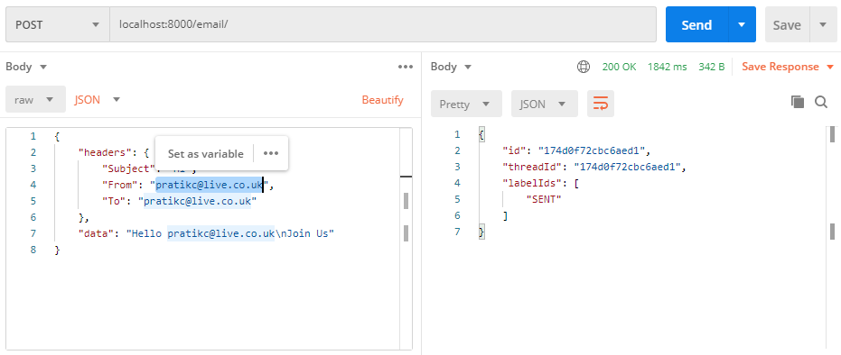
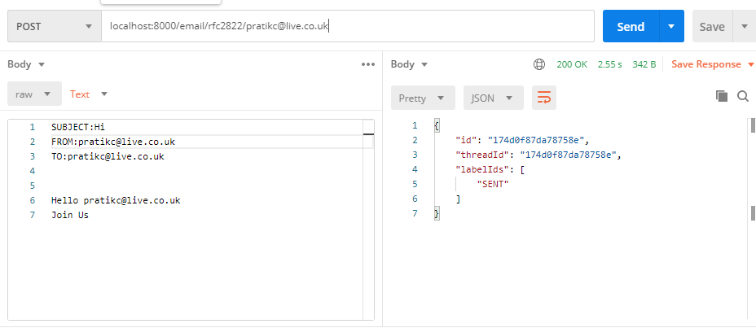

# Google Mail Oauth Rest API

1. No Google/OAuth Library used
    - Instead we are using API calls to do the same thing that
    - The Library handles for us
    - Refer to [controller](/controller) directory for more information
2. Used ESLint and Prettier to improve Code Formatting and Maintainability
3. Used GitHub Actions to make it easier to verify
4. Realistically I would prefer [TSED](https://tsed.io/) because of it's integration with OpenAPI and usage of TypeScript Generators
    1. Using OpenAPI would improve Code Documentation Massively.
5. Libraries used Additional

    1. http-status-codes
        - Makes Code Easier to Follow Especially if one does not remember all HTTP Status Codes
        - And most of us do not remember any of them except the famous ones
    2. Node-Fetch
        - Used Node-Fetch to make API Requests
        - Provides same API as Browser Fetch

6. Usage
    1. Run `npm install`
    2. Run `npm run build` to generate our JavaScript Code
    3. Run `npm start` to start the server
    4. By Default runs on Port 8000
7. Automated Deployment to Heroku
8. File generated is api.json
    - Stores all the User Metadata
9. Realistically we would
    - Issue a JWT Token on Sign In to User
    - Ask user to use this JWT Token on each and every attempt
    - Only if JWT Token Is Accepted to be user's own
    - Do we let user Send an EMail
    - But this is a Proof of Concept

# ROUTES

1.  URL GET /  
    [Homepage](/): [/](/) Log into Google  
    
2.  POST Mail [/email/:sender](/email/:sender)  
    Send Email in specified format  
    Your GMail ID is Assumed from the Params  
     
3.  POST Mail. [/email/](/email)  
    Assume Sender from Header  
     Send Email in specified format  
     
4.  POST MAIL RFC2822 [/email/RFC2822/:sender](/email/RFC2822)  
    Specify Sender EMail ID as Param  
     Send EMail with RFC2822 format
    
5.  GET Users [/users](/users) Lists all Users  
    
